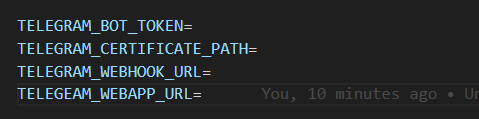

# Tarvis - Telegram Bot

## Packages Used

-   [Telegram Bot API - PHP SDK](https://github.com/irazasyed/telegram-bot-sdk)

## Web app frontend

-   Vue JS v3.0

## Project Backend

-   Laravel v10.0

## Installation

### Preparing the bot

[Step 01] Create a new bot from telegram bot from `botfather` and store the `access_token` <br>
[Step 02] Go to `/mybots` and create a custom comman `tasks` (For using this task module ! You can use anything you like) <br>

### Seting up the project

[Step 01] Clone the repo <br>
[Step 02] Install the php and npm packages

```
composer install
npm install
```

[Step 03] Create a `.env` file from `.env.exmaple` <br>
[Step 04] Connect DB and Run laravel migration command <br>
[Step 04] If you are in local environment. Serve the project and use [ngrok](https://ngrok.com/) to get a tunnel link. <br>
[Step 05] Put all the telegram cred there <br>
 <br>
[Step 06] In `resources/js/app.js` set `axios.defaults.baseURL`

### Create telegram webhook

[Step 01] Set up webhook with your project URL by hitting this URL

```
https://api.telegram.org/bot{{Bot_ID}}:{{Bot_Access_token}}/setWebhook?url={{Project_URL}}/webhook
```

[Optional] If you want to delete your webhook

```
https://api.telegram.org/bot{{Bot_ID}}:{{Bot_Access_token}}/deleteWebhook
```

## Usage

Go to telegram , Search your Bot and `/start` to register and `/task` to enter the module.

<hr>
Cheers :wine_glass:

